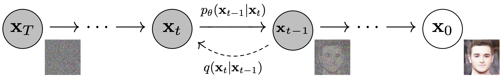

# Denoising Diffusion Probabilistic Models
An implementation of Diffusion Models in PyTorch .
 
## What is a Diffusion Probabilistic Model?
The "diffusion model" is a computer model based on Markov chains, trained using a technique called variational inference. It is designed to generate samples that are similar to real data after a certain amount of time. The model learns how to undo the effects of a process called diffusion, which involves adding noise to data in a way that slowly distorts it. When the diffusion process involves small amounts of a type of noise called Gaussian noise, the model can be made simpler by using a type of neural network that uses Gaussian distributions.

    

## What does this repository contain?
A simple implementation of the paper [Denoising Diffusion Probabilistic Models](https://arxiv.org/pdf/2006.11239.pdf). 
I used [Oxford 102 Flower](https://www.robots.ox.ac.uk/~vgg/data/flowers/102/) dataset containing 102 categories of flowers, each with 40 to 258 images, 8189 images in total (available in `torchvision.datasets`).
